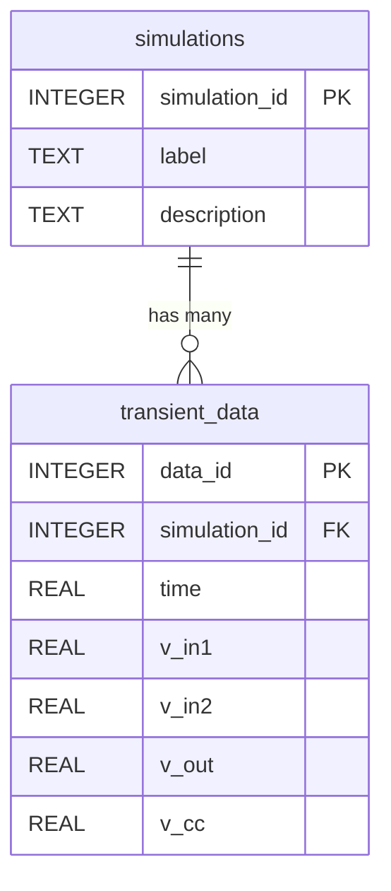
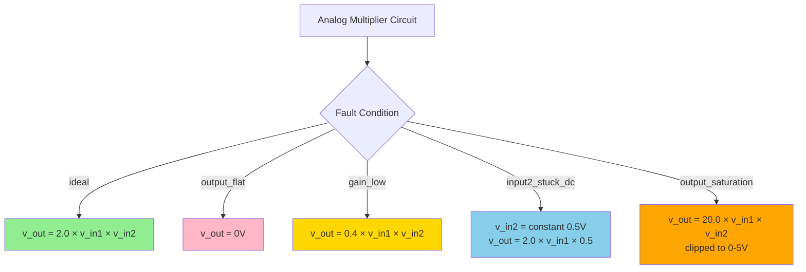
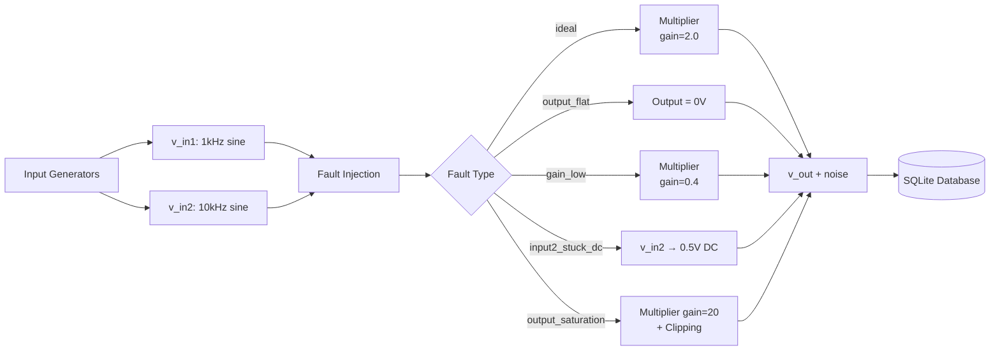

# Analog Multiplier Circuit Simulation Dataset

## About This Dataset

This dataset was created as part of the research paper **"A Digital Twin-Enabled Lab-in-a-Pocket Cyber-Physical Ecosystem for Engineering Education with ML-Based Fault Diagnosis and Agentic AI"** by Mohamed et al. (2026). The dataset addresses a critical challenge in engineering education: enabling effective machine learning-based fault detection with minimal training data, simulating the realistic scenario of first-semester deployment where only a limited number of correct student circuit submissions are available.

### Data Collection Methodology

The dataset was generated through **SPICE-based circuit simulations** with controlled fault injection to create realistic analog circuit failure scenarios. Each simulation captures the time-domain behavior of an analog multiplier circuit designed to produce the relationship: `v_out = 2.0 × v_in1 × v_in2`.

**Simulation Software:** SPICE (Simulation Program with Integrated Circuit Emphasis)
**Circuit Type:** Analog Multiplier (BJT/Op-amp based topology)
**Fault Injection:** Systematic introduction of five distinct fault conditions to model common student design errors
**Noise Modeling:** Gaussian noise (σ=5mV) added to all signals to simulate realistic measurement conditions

### Educational Context

This dataset represents an **extreme educational challenge scenario** where a machine learning system must achieve reliable fault detection with only **16 correct training samples**, mimicking real-world first-semester deployment conditions before large labeled datasets accumulate. The research demonstrates that with proper feature engineering, an Autoencoder-based anomaly detection system can achieve **95.36% F1-score** even with this minimal training data, representing a **312× data efficiency improvement** over prior work.

### Citation

If you use this dataset in your research, please cite:

```bibtex
@misc{analogmult2026,
  author = {Mohsen, Mohammed and Mohamed, Noor El-Deen M. and Akwah, Omar E. and Hassan, Hadeer A.},
  title = {Analog Multiplier Circuit Simulation Dataset},
  howpublished = {\url{https://github.com/MohammedMohsen0404/linkit}},
  year = {2026},
  note = {SQLite database with 100 simulations and 1,000,000 time-series data points for circuit fault detection}
}
```

**Related Paper:** Mohamed, N.M., et al. (2026). "A Digital Twin-Enabled Lab-in-a-Pocket Cyber-Physical Ecosystem for Engineering Education with ML-Based Fault Diagnosis and Agentic AI."

---

## Technical Overview

This SQLite database contains labeled time-series data from simulated analog multiplier circuits with various fault conditions. The dataset is designed for AI/ML training to detect and classify circuit failures in educational settings.

**Database File:** `circuit_simulations.db`
**Total Simulations:** 100
**Data Points per Simulation:** 10,000
**Total Records:** 1,000,000
**Sampling Rate:** 1μs (1 MHz)
**Simulation Duration:** 10ms per circuit

---

## Database Schema



---

## Table Definitions

### `simulations`
Stores metadata for each simulation run.

| Column | Type | Description |
|--------|------|-------------|
| `simulation_id` | INTEGER | Primary key (1-100) |
| `label` | TEXT | Fault condition label (see below) |
| `description` | TEXT | Human-readable description of the fault |

**Example Rows:**
```
simulation_id | label              | description
1             | ideal              | Normal operation with gain=2.0
2             | output_flat        | Output stuck at 0V
3             | gain_low           | Reduced gain (0.4 instead of 2.0)
```

---

### `transient_data`
Contains time-series measurements for each simulation.

| Column | Type | Description |
|--------|------|-------------|
| `data_id` | INTEGER | Auto-incrementing primary key |
| `simulation_id` | INTEGER | Foreign key to `simulations` table |
| `time` | REAL | Time in seconds (0 to 0.01s) |
| `v_in1` | REAL | Input 1 voltage (V) |
| `v_in2` | REAL | Input 2 voltage (V) |
| `v_out` | REAL | Output voltage (V) |
| `v_cc` | REAL | Supply voltage (V), typically ~5V |

**Sample Row:**
```
data_id | simulation_id | time     | v_in1   | v_in2   | v_out   | v_cc
1       | 1             | 0.000000 | 0.0045  | 0.0023  | 0.0001  | 5.0002
2       | 1             | 0.000001 | 0.0063  | 0.0315  | 0.0004  | 4.9998
```

---

## Fault Labels and Expected Behavior



### Label Details

| Label | Behavior | Expected v_out Range | Notes |
|-------|----------|---------------------|-------|
| `ideal` | Normal multiplication with gain=2.0 | -1.0V to +1.0V | Baseline for comparison |
| `output_flat` | Output circuit failure | ~0V (±5mV noise) | Complete output failure |
| `gain_low` | Reduced gain (20% of normal) | -0.2V to +0.2V | Partial circuit degradation |
| `input2_stuck_dc` | Input 2 stuck at 0.5V DC | Varies with v_in1 | Input stage failure |
| `output_saturation` | Excessive gain causes clipping | 0V to 5V (hard limits) | Amplifier saturation |

---

## Signal Specifications

### Input Signals (Ideal Conditions)

| Signal | Amplitude | Frequency | Equation |
|--------|-----------|-----------|----------|
| `v_in1` | 1.0V | 1 kHz | `1.0 × sin(2π × 1000 × t)` |
| `v_in2` | 0.5V | 10 kHz | `0.5 × sin(2π × 10000 × t)` |

**Noise:** All signals have Gaussian noise added (μ=0, σ=5mV)

### Time Parameters
- **Start:** 0s
- **End:** 0.01s (10 milliseconds)
- **Step:** 1µs (1×10⁻⁶ seconds)
- **Points:** 10,000 per simulation

---

## Data Flow Diagram



---

## SQL Query Examples

### Get all simulations with a specific fault
```sql
SELECT * FROM simulations 
WHERE label = 'output_saturation';
```

### Get time-series data for simulation #5
```sql
SELECT time, v_in1, v_in2, v_out, v_cc
FROM transient_data
WHERE simulation_id = 5
ORDER BY time;
```

### Count simulations by fault type
```sql
SELECT label, COUNT(*) as count
FROM simulations
GROUP BY label
ORDER BY count DESC;
```

### Get data at specific time point (t=0.005s) for all simulations
```sql
SELECT s.simulation_id, s.label, t.v_in1, t.v_in2, t.v_out
FROM transient_data t
JOIN simulations s ON t.simulation_id = s.simulation_id
WHERE ABS(t.time - 0.005) < 1e-7;
```

### Calculate average output voltage per simulation
```sql
SELECT s.simulation_id, s.label, 
       AVG(t.v_out) as avg_vout,
       MIN(t.v_out) as min_vout,
       MAX(t.v_out) as max_vout
FROM transient_data t
JOIN simulations s ON t.simulation_id = s.simulation_id
GROUP BY s.simulation_id
ORDER BY s.simulation_id;
```

### Export specific simulation to CSV (use SQLite CLI)
```bash
sqlite3 circuit_simulations.db <<EOF
.headers on
.mode csv
.output simulation_1.csv
SELECT * FROM transient_data WHERE simulation_id = 1;
.quit
EOF
```

---

## Data Statistics

### Expected Value Ranges

| Signal | Min (V) | Max (V) | Typical RMS (V) |
|--------|---------|---------|-----------------|
| `v_in1` | -1.01 | +1.01 | 0.71 |
| `v_in2` (normal) | -0.51 | +0.51 | 0.35 |
| `v_in2` (stuck_dc) | ~0.50 | ~0.50 | 0.50 |
| `v_out` (ideal) | -1.0 | +1.0 | varies |
| `v_out` (flat) | -0.02 | +0.02 | ~0.005 |
| `v_out` (low_gain) | -0.2 | +0.2 | varies |
| `v_out` (saturation) | 0.0 | 5.0 | varies |
| `v_cc` | 4.99 | 5.01 | 5.0 |

### Label Distribution
The 100 simulations are randomly distributed across fault types. Typical distribution:
- **ideal:** ~20 simulations
- **output_flat:** ~20 simulations
- **gain_low:** ~20 simulations
- **input2_stuck_dc:** ~20 simulations
- **output_saturation:** ~20 simulations

*(Exact counts vary due to random assignment)*

---

## Data Quality Notes

✅ **What's Good:**
- Clean, consistent sampling rate (1µs)
- Realistic noise levels (5mV)
- Well-defined fault conditions
- Proper database normalization
- Indexed for fast queries

⚠️ **Limitations:**
- Noise is Gaussian (real circuits may have 1/f noise)
- No component aging or temperature effects
- Fault conditions are static (don't evolve over time)
- Supply voltage (`v_cc`) has minimal variation
- No electromagnetic interference simulation

---

## Machine Learning Considerations

### Feature Engineering Suggestions
1. **Time Domain Features:**
   - Mean, std, min, max of v_out
   - Zero-crossing rate
   - Peak-to-peak amplitude
   
2. **Frequency Domain Features:**
   - FFT of v_out to detect harmonic distortion
   - Spectral entropy
   - Dominant frequency components

3. **Correlation Features:**
   - Cross-correlation between v_in1 and v_out
   - Phase delay measurements

### Train/Test Split Recommendation
- **Training:** 70 simulations (70%)
- **Validation:** 15 simulations (15%)
- **Testing:** 15 simulations (15%)

Use `simulation_id` for splitting to ensure temporal independence.

### Class Imbalance
Labels are approximately balanced (~20 each). No special handling needed.

---

## File Information

**Database Size:** ~160-200 MB (depending on SQLite overhead)  
**Compression:** Can be compressed to ~40-50 MB with gzip  
**Python Dependencies:** `numpy`, `sqlite3` (built-in)  
**Generation Time:** ~30-60 seconds on modern hardware

---

## Troubleshooting

### Database is locked
```bash
# Check for processes using the database
lsof circuit_simulations.db

# Or use WAL mode for concurrent access
sqlite3 circuit_simulations.db "PRAGMA journal_mode=WAL;"
```

### Memory issues when loading data
```python
# Use chunked reading
import sqlite3
import pandas as pd

conn = sqlite3.connect('circuit_simulations.db')
for chunk in pd.read_sql_query(
    "SELECT * FROM transient_data", 
    conn, 
    chunksize=100000
):
    process(chunk)
```

### Verify data integrity
```sql
-- Check for missing time points
SELECT simulation_id, COUNT(*) as point_count
FROM transient_data
GROUP BY simulation_id
HAVING point_count != 10000;

-- Check for NULL values
SELECT COUNT(*) FROM transient_data
WHERE v_in1 IS NULL OR v_in2 IS NULL OR v_out IS NULL;
```

---

## Contact

**Data Generated:** 2024  
**Script Version:** 1.0  
**Questions:** Don't contact me. Figure it out.  
**Documentation:** This file contains everything you need.

---

## Quick Start for Data Engineer

```python
import sqlite3
import pandas as pd

# Connect to database
conn = sqlite3.connect('circuit_simulations.db')

# Load all simulation metadata
sims = pd.read_sql_query("SELECT * FROM simulations", conn)
print(f"Loaded {len(sims)} simulations")

# Load time-series for first simulation
data = pd.read_sql_query(
    "SELECT * FROM transient_data WHERE simulation_id = 1", 
    conn
)
print(f"Simulation 1 has {len(data)} data points")

# Quick visualization
import matplotlib.pyplot as plt
plt.figure(figsize=(12, 4))
plt.plot(data['time'], data['v_out'])
plt.xlabel('Time (s)')
plt.ylabel('v_out (V)')
plt.title('Output Voltage - Simulation 1')
plt.grid(True)
plt.show()

conn.close()
```

---
